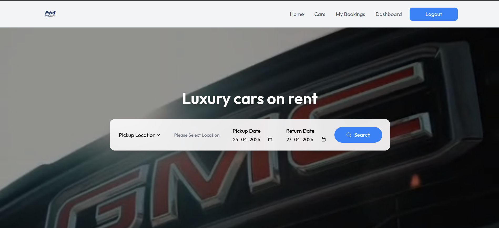
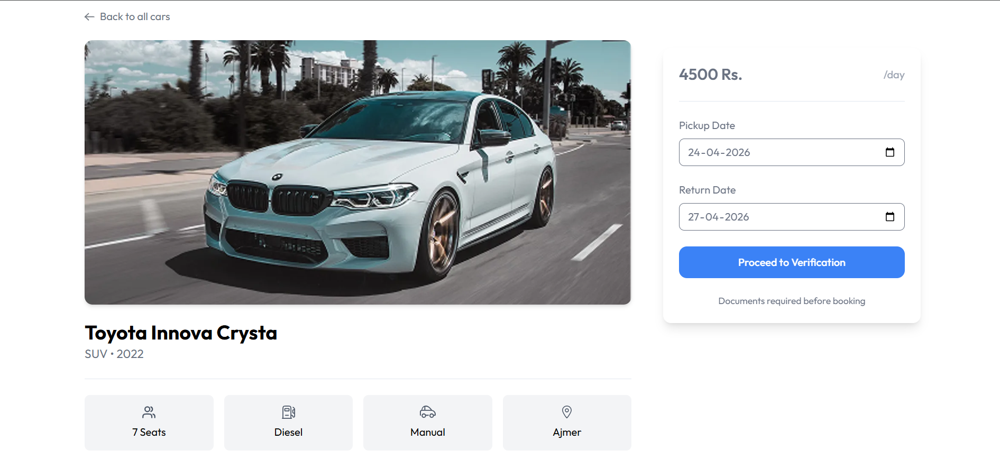
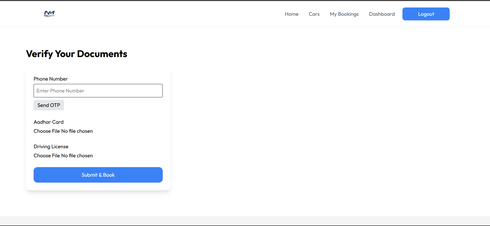
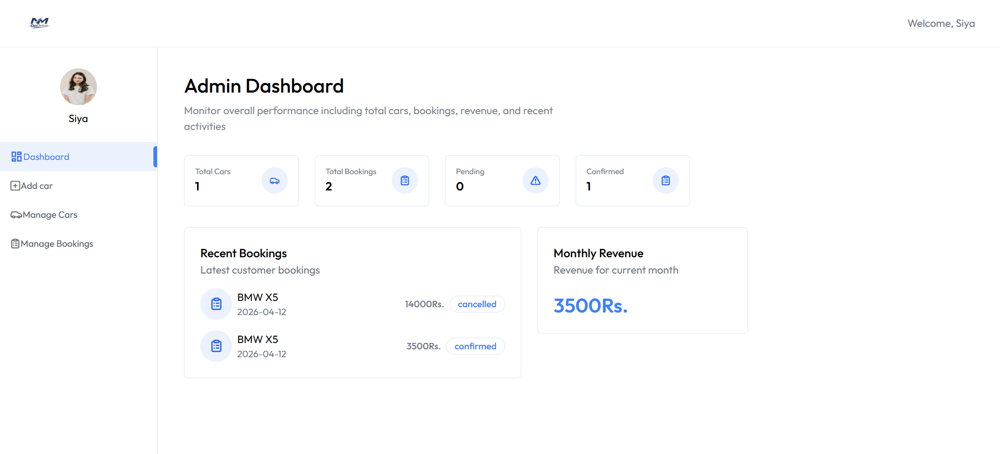

# 🚗 AI Car Rental & Verification Platform  

Smart Car Booking System with Document Verification & Real-Time Availability 🚀  
Making car rentals smarter, safer, and more efficient ❤️  

---

# 🏷️ Badges


---


# 🧠 Problem Statement  

Traditional car rental systems face several issues:

❌ Double bookings  
❌ Lack of proper user verification  
❌ Poor user experience  
❌ Manual management for owners  

---

# 💡 Solution  

This project provides a **smart, full-stack car rental platform** that:

✔ Enables real-time car booking  
✔ Prevents overlapping bookings  
✔ Verifies users using Aadhar & Driving License  
✔ Provides dashboards for users & owners  
✔ Scalable for future AI integration  

---

# 🏗️ System Architecture  

Frontend (React) ↔ Backend (Node.js + Express) ↔ Database (MongoDB)  
                                      ⬇  
                         ImageKit (Image Storage)

---

# ✨ Key Features  

## 🔥 Core Features  
✔ Real-time car booking system  
✔ Smart date validation (no double booking)  
✔ Dynamic price calculation  
✔ Booking status management  

---

## 🔐 Verification System  
✔ Aadhar & Driving License upload  
✔ OTP-based phone verification  
✔ Secure document storage (ImageKit)  
✔ Authentication & authorization (JWT)  

---

## 👨‍💼 Owner Dashboard  
✔ Add / delete cars  
✔ Manage bookings  
✔ Toggle car availability  
✔ View dashboard analytics  

---

## 🌐 Web Features  
✔ Modern React UI (responsive)  
✔ Toast notifications  
✔ Role-based routing  
✔ Image preview before upload  

---

## 🧠 Future AI Features  
✔ Smart car recommendation system  
✔ Demand-based pricing  
✔ User behavior analytics  

---

# 🧪 Tech Stack  

| Layer | Technologies Used |
|------|------------------|
| Frontend | React, Tailwind CSS |
| Backend | Node.js, Express |
| Database | MongoDB |
| Image Storage | ImageKit |
| Authentication | JWT |
| State Management | Context API |

---

# 📊 Performance & Design Highlights  

⚡ Fast booking system with validation  
🛡️ Secure APIs with middleware protection  
📦 Modular backend architecture  
📁 Clean & scalable folder structure  
🎯 Smooth UI/UX experience  

---

# ⚙️ Installation  

## 1️⃣ Clone Repository  

```bash
git clone https://github.com/yourusername/car-rental-system.git
cd car-rental-system
```

## 2️⃣ Backend Setup
```bash
cd Backend
npm install
```

Create .env file:

```bash
PORT=5000
MONGO_URI=your_mongodb_uri
JWT_SECRET=your_secret_key

IMAGEKIT_PUBLIC_KEY=your_key
IMAGEKIT_PRIVATE_KEY=your_key
IMAGEKIT_URL_ENDPOINT=your_url
```

## 3️⃣ Frontend Setup

```bash
cd Frontend
npm install
npm run dev
```

## 4️⃣ Run Backend
```bash
cd Backend
npm run start
```
**👉 Open in browser:**

Frontend → http://localhost:5173

Backend → http://localhost:5000

---

# 🖼️ Screenshots

<p align="center">
  
  <br>
  <b>Home Page</b>
</p>

<p align="center">
  
  <br>
  <b>Car Details Page</b>
</p>

<p align="center">
  
  <br>
  <b>Verification Page</b>
</p>

<p align="center">
  
  <br>
  <b>Owner Dashboard</b>
</p>

---

# 🔐 Security Best Practices

✔ JWT-based authentication

✔ Protected routes (middleware)

✔ Environment variables for secrets

✔ No hardcoded credentials

---

# 🚀 Future Enhancements

🤖 AI-based recommendation system

💳 Payment integration (Razorpay / Stripe)

📅 Smart calendar with disabled booked dates

📱 Mobile app integration

📊 Advanced analytics dashboard

---

# 📈 Impact

This system can be used in:


🚗 Car rental startups

🏢 Fleet management systems

📱 Rental mobile applications

🌍 Smart mobility solutions

---

# 🤝 Contributing

Contributions are welcome!

Fork the repo

Create a new branch

Commit changes

Submit a Pull Request 🚀

---

# 📜 License

MIT License

---

# 👩‍💻 Author

Harshita Surana
B.Tech AI-ML Student
